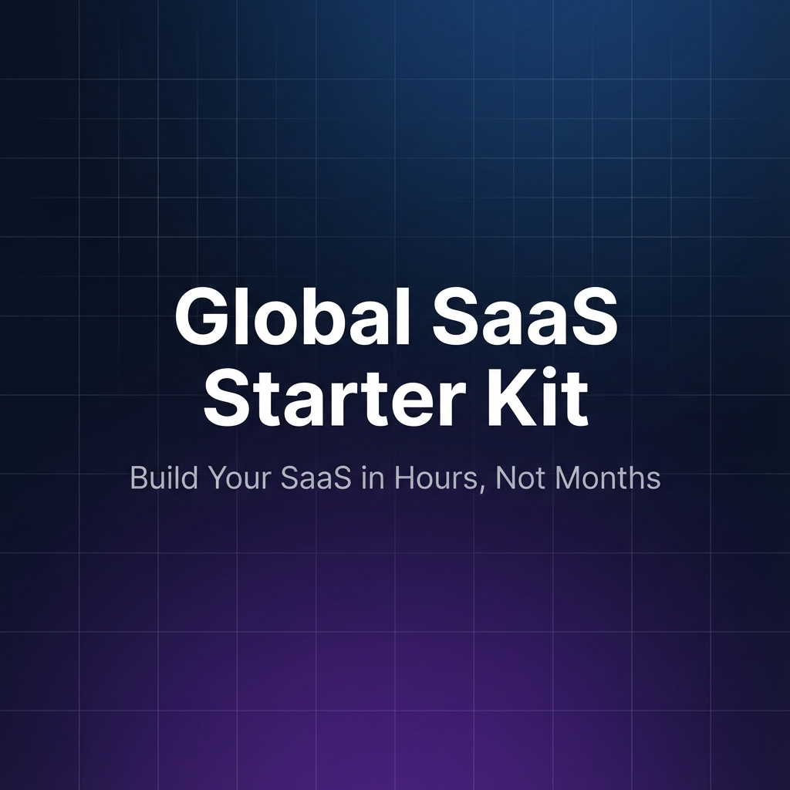

<p align="center">
  
</p>

<h1 align="center">FireShip Starter Kit</h1>

<p align="center">
  AI 서비스 40개를 만들면서 다듬은 보일러플레이트.<br/>
  인증, 결제, AI, 이메일 다 들어있어요.<br/>
  내 서비스 만드는 데만 집중하세요.
</p>

<p align="center">
  <a href="https://fire-ship-zip3.vercel.app"><strong>데모 보기 →</strong></a>
</p>

<p align="center">
  <a href="#시작하기">시작하기</a> · <a href="#뭐가-들어있나요">기능</a> · <a href="#하나씩-알아볼게요">설정 가이드</a> · <a href="#자주-묻는-질문">FAQ</a>
</p>

---

## 이게 뭔가요?

**FireShip Starter Kit**은 SaaS 서비스를 빠르게 만들 수 있는 Next.js 보일러플레이트예요.

보통 SaaS를 만들려면 로그인, 결제, 이메일, 어드민... 이런 것들을 하나씩 직접 만들어야 하잖아요. 그걸 다 미리 만들어놨어요. 여기에 AI 채팅, 이미지 생성, RAG 챗봇까지 들어있어요.

내 서비스의 **핵심 기능**만 만들면 돼요. 나머지는 이미 되어있으니까요.

> 코딩이 처음이어도 괜찮아요. Claude Code랑 같이 하면 돼요.

---

## 뭐가 들어있나요?

### 기본 기능

| 기능 | 설명 | 기술 |
|------|------|------|
| 로그인 | Google 로그인, Magic Link | Supabase Auth |
| 결제 | 구독 결제, 고객 포털 | LemonSqueezy |
| 이메일 | 환영, 런칭, 결제실패 알림 | Resend + React Email |
| 다국어 | 한국어/영어 자동 전환 | next-intl |
| 어드민 | 고객, 판매, 티켓, 웹훅 관리 | 대시보드 내장 |
| 고객지원 | 티켓 시스템 (생성/관리) | Supabase |
| 블로그 | MDX 기반 블로그 | next-mdx-remote |
| SEO | JSON-LD, sitemap, robots.txt | 내장 |

### AI 기능 (Vercel AI SDK)

[Vercel AI SDK](https://sdk.vercel.ai)를 사용해요. **특정 모델에 고정되어 있지 않아요.** 코드 한 줄만 바꾸면 다른 모델로 교체할 수 있어요.

| 기능 | 기본 설정 | 다른 모델로 교체 가능 |
|------|----------|---------------------|
| AI 채팅 | OpenAI GPT-4o | Claude, Gemini, Llama 등 |
| 이미지 생성 | OpenAI DALL-E 3 | 다른 이미지 모델 |
| 영상 생성 | FAL (선택) | 다른 영상 모델 |
| RAG 챗봇 | Google Gemini | OpenAI, Claude 등 |
| 지식 베이스 | Google 임베딩 | OpenAI 임베딩 등 |
| 분석 대시보드 | 내장 Analytics | — |

#### API 키 설정 방법 (2가지)

**방법 1: Vercel AI Gateway 사용 (추천, 초보자용)**

[Vercel AI Gateway](https://vercel.com/ai-gateway)에 가입하면 **$5 무료 크레딧**을 줘요. 별도 API 키 없이 바로 모든 모델을 써볼 수 있어요.

- 가입만 하면 GPT-4o, Claude, Gemini 등 **모든 모델**을 바로 사용 가능
- 마크업 0% — 원가 그대로
- 무료 크레딧은 매월 갱신 (첫 결제 전까지)

**방법 2: 직접 API 키 발급 (BYOK)**

각 AI 서비스에서 직접 API 키를 발급받아 쓸 수도 있어요.

```bash
# .env.local에 원하는 키만 넣으면 돼요
OPENAI_API_KEY=sk-...              # OpenAI (채팅, 이미지)
GOOGLE_GENERATIVE_AI_API_KEY=...   # Google AI (RAG 챗봇)
ANTHROPIC_API_KEY=...              # Claude (채팅 대체)
```

> Vercel AI SDK는 [20개 이상의 AI 프로바이더](https://sdk.vercel.ai/docs/ai-sdk-core/providers-and-models)를 지원해요. OpenAI, Google, Anthropic, Meta, Mistral, Cohere 등 원하는 모델을 자유롭게 쓸 수 있어요.

### 디자인

| 기능 | 설명 |
|------|------|
| DaisyUI v5 | 커스텀 테마 2개 (다크/라이트) |
| Tailwind CSS v4 | oklch 컬러 시스템 |
| shadcn/ui | Radix 기반 컴포넌트 27개 |
| GSAP 애니메이션 | 히어로, 스크롤, 패럴렉스 |
| 반응형 | 모바일/태블릿/데스크톱 |

---

## 시작하기

### 방법 1: AI랑 같이 하기 (추천)

Claude Code를 쓰면 AI가 알아서 설정해줘요.

```bash
# 1. 프로젝트 다운로드
git clone https://github.com/imgompanda/FireShipZip3.git
cd FireShipZip3

# 2. Claude Code 실행
claude

# 3. 이렇게 말하면 끝이에요
```

```
docs/llm.md 파일을 읽고, 온보딩 매니저로서 설정을 시작해줘
```

AI가 `setup_progress.md`를 만들고, 단계별로 안내해줘요.
"Supabase 계정 만드셨나요?" → "환경변수 여기에 넣어주세요" → "결제 연동할까요?" 이런 식으로요.

질문에 답만 해주면 돼요.

### 방법 2: 직접 하기

```bash
# 1. 다운로드
git clone https://github.com/imgompanda/FireShipZip3.git
cd FireShipZip3

# 2. 설치
npm install

# 3. 환경변수 설정
cp .env.local.example .env.local
# .env.local 파일을 열어서 값을 채워주세요

# 4. 실행
npm run dev
```

`http://localhost:3000`에서 확인할 수 있어요.

---

## 하나씩 알아볼게요

`docs/` 폴더에 단계별 가이드가 있어요. 순서대로 따라하면 돼요.

### 필수 설정

| 순서 | 문서 | 한 줄 설명 |
|------|------|-----------|
| 0 | [docs/00-overview](docs/00-overview) | 필요한 계정 만들기 (Supabase, LemonSqueezy, Resend) |
| 1 | [docs/01-quick-start](docs/01-quick-start) | npm install, .env.local 설정, 로컬 실행 |
| 2 | [docs/02-deployment](docs/02-deployment) | Vercel 배포 (URL 먼저 확정!) |
| 3 | [docs/03-supabase](docs/03-supabase) | 로그인 설정 (Google OAuth + Magic Link) |

### 선택 설정 (필요한 것만)

| 순서 | 문서 | 한 줄 설명 |
|------|------|-----------|
| 4 | [docs/04-lemon](docs/04-lemon) | 결제 연동 (LemonSqueezy) |
| 5 | [docs/05-resend](docs/05-resend) | 이메일 발송 (Resend) |
| 7 | [docs/07-ai-customization](docs/07-ai-customization) | AI 프롬프트 커스터마이징 |
| 8 | [docs/08-admin-console](docs/08-admin-console) | 어드민 대시보드 |
| 9 | [docs/09-seo](docs/09-seo) | 검색엔진 최적화 |
| 10 | [docs/10-ui](docs/10-ui) | UI 컴포넌트 & 테마 변경 |
| 11 | [docs/11-support](docs/11-support) | 고객 지원 시스템 |

### AI 기능 설정

| 순서 | 문서 | 한 줄 설명 |
|------|------|-----------|
| 13 | [docs/13-claude-code](docs/13-claude-code) | Claude Code 설치 + 활용법 |
| 14 | [docs/14-analytics](docs/14-analytics) | 분석 대시보드 설정 |
| 15 | [docs/15-storage](docs/15-storage) | AI 이미지/영상 저장소 |
| 16 | [docs/16-ai-sdk](docs/16-ai-sdk) | AI 채팅, 이미지, 영상 생성 |
| 18 | [docs/18-rag-chatbot](docs/18-rag-chatbot) | RAG 기반 AI 챗봇 |

> 선택 설정은 안 해도 돼요. 나중에 필요할 때 추가하면 돼요.

---

## 기술 스택

```
Next.js 16        — 프레임워크
React 19          — UI
TypeScript 5      — 타입 안전성
Tailwind CSS 4    — 스타일링
DaisyUI 5         — UI 컴포넌트
shadcn/ui         — Radix 기반 컴포넌트
Supabase          — 인증 + 데이터베이스
LemonSqueezy      — 결제
Resend            — 이메일
Vercel AI SDK     — AI 채팅/이미지/영상
GSAP              — 애니메이션
Zustand           — 상태관리
next-intl         — 다국어
```

---

## 환경변수

`.env.local.example` 파일을 `.env.local`로 복사하고, 값을 채워주세요.

```bash
# 필수
NEXT_PUBLIC_SUPABASE_URL=        # Supabase 프로젝트 URL
NEXT_PUBLIC_SUPABASE_ANON_KEY=   # Supabase 공개 키
SUPABASE_SERVICE_ROLE_KEY=       # Supabase 서비스 키
NEXT_PUBLIC_APP_URL=             # 배포 URL (예: https://my-app.vercel.app)
ADMIN_EMAILS=                    # 어드민 이메일 (쉼표 구분)

# 결제 (선택)
LEMONSQUEEZY_API_KEY=
LEMONSQUEEZY_STORE_ID=
LEMONSQUEEZY_WEBHOOK_SECRET=

# 이메일 (선택)
RESEND_API_KEY=
RESEND_FROM_EMAIL=

# AI (선택 — 둘 중 하나만 있으면 돼요)
# 방법 1: Vercel AI Gateway (가입하면 $5 무료)
# → vercel.com/ai-gateway 에서 키 발급
# 방법 2: 직접 API 키 발급
OPENAI_API_KEY=                  # OpenAI (채팅/이미지)
GOOGLE_GENERATIVE_AI_API_KEY=    # Google AI (RAG 챗봇)
ANTHROPIC_API_KEY=               # Claude (선택)
```

---

## fireauto 플러그인

이 보일러플레이트와 함께 쓸 수 있는 Claude Code 자동화 플러그인이에요. 1년간 AI 서비스 40개를 만들면서 매일 반복한 작업들을 커맨드 하나로 실행할 수 있어요.

```bash
# Claude Code에서
/plugin marketplace add imgompanda/fireauto
/plugin install fireauto@fireauto
```

설치하면 이런 걸 할 수 있어요:

| 커맨드 | 설명 |
|--------|------|
| `/fireauto-seo` | SEO 자동 점검 (robots.txt, 메타태그, JSON-LD 등) |
| `/fireauto-secure` | 보안 취약점 점검 (.env 노출, API 인증, rate limit 등) |
| `/fireauto-ui` | DaisyUI로 UI 만들기 / shadcn 마이그레이션 |
| `/fireauto-prd` | 아이디어 한 줄로 상세 PRD 만들기 |
| `/fireauto-team` | 여러 AI가 동시에 작업하고 서로 대화하며 협업 |
| `/fireauto-research` | 레딧에서 고객 찾기 + 리드 스코어링 |

[fireauto 자세히 보기 →](https://github.com/imgompanda/fireauto)

---

## 자주 묻는 질문

### 코딩을 전혀 몰라도 쓸 수 있나요?

Claude Code랑 같이 하면 가능해요. `docs/llm.md`를 AI한테 읽히면, AI가 단계별로 안내해줘요.

### 돈이 드나요?

보일러플레이트 자체는 오픈소스예요. 다만 외부 서비스 비용이 있어요:
- **Supabase** — 무료 플랜으로 시작 가능
- **Vercel** — 무료 플랜으로 시작 가능
- **LemonSqueezy** — 결제 시 수수료만
- **Resend** — 월 100통 무료
- **OpenAI API** — AI 기능 쓸 때만 과금
- **Claude Code** — Max 플랜 $100/월 (AI 코딩 도구)

### 어떤 서비스를 만들 수 있어요?

B2B SaaS, AI 도구, 구독형 서비스, 마켓플레이스 등 뭐든 가능해요. 실제로 이 보일러플레이트로 40개 이상의 서비스를 만들었어요.

---

## FireShip 부트캠프

> **수익화 바이브 코딩 부트캠프** — 5일 만에 AI 서비스 기획부터 배포까지

이 보일러플레이트를 만든 사람이 직접 가르치는 부트캠프예요.

| 날짜 | 내용 |
|------|------|
| Day 1 (월) | Claude Code 세팅 + AI SDK + MCP 활용 |
| Day 2 (화) | AI 이미지 생성 서비스, RAG 챗봇 구축 실습 |
| Day 3 (수) | 결제 연동 + 수익화 + 레딧 수요조사 + 아이디어 확정 |
| Day 4 (목) | 내 서비스 만들기 + 1:1 코칭 |
| Day 5 (금) | 완성 + 배포 + 런칭 준비 |

- 40개 서비스로 다듬은 **보일러플레이트 평생 제공** + 업데이트
- 기수별 단톡방 + **수료생 전용 커뮤니티**
- S전자 강의 만족도 **4.8점** · **10명 한정** 소수 정예

**[부트캠프 자세히 보기 →](https://fireship.me/ko/bootcamp)**

---

## 기업 AX (AI Transformation)

> 강의에서 끝나지 않습니다. 실제로 돌아가는 시스템을 만들어드립니다.

| 서비스 | 설명 | 성과 |
|--------|------|------|
| **임직원 교육** | 클로드 코드 기초부터 실무까지. 비개발자도 참여 가능 | 업무 생산성 40%↑ |
| **맞춤형 자동화** | 반복 업무를 AI 기반 자동화 시스템으로 전환 | 반복 업무 70% 절감 |
| **사내 툴 개발** | 외부 SaaS 대체하는 맞춤형 AI 툴 구축 | SaaS 비용 60% 절감 |

S전자 MX·VD 사업부 교육 · B2B SaaS $8K MRR 달성

**[기업 문의하기 →](https://fireship.me/ko/enterprise)**

---

## About

Made by [FreAiner](https://fireship.me)

1년간 Claude Code로 AI 서비스 40개를 만들고, 그 중 3개를 수익화한 1인 개발자예요.

- Web: [fireship.me](https://fireship.me)
- Threads: [@freainer](https://www.threads.net/@freainer)
- Plugin: [fireauto](https://github.com/imgompanda/fireauto)

## License

MIT
